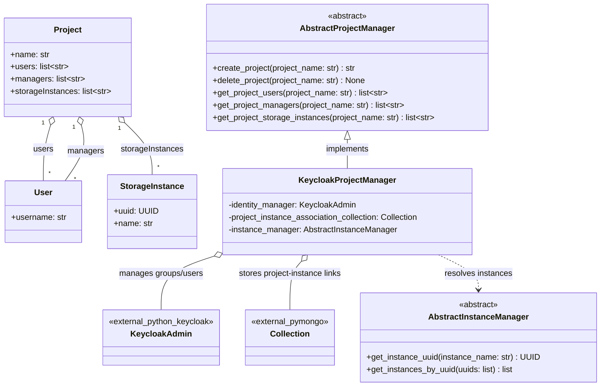

**Last Updated:** 2026-06-29

# Project Management Class Diagram

```mermaid
classDiagram
    %% Core Entities
    class Project {
        +name: str
        +users: list~str~
        +managers: list~str~
        +storageInstances: list~str~
    }

    class User {
        +username: str
    }

    class StorageInstance {
        +uuid: UUID
        +name: str
    }

    %% Interfaces / Abstract Classes
    class AbstractProjectManager {
        <<abstract>>
        +create_project(project_name: str) str
        +delete_project(project_name: str) None
        +get_project_users(project_name: str) list~str~
        +get_project_managers(project_name: str) list~str~
        +get_project_storage_instances(project_name: str) list~str~
    }

    class AbstractInstanceManager {
        <<abstract>>
        +get_instance_uuid(instance_name: str) UUID
        +get_instances_by_uuid(uuids: list) list
    }

    %% Implementations
    class KeycloakProjectManager {
        -identity_manager: KeycloakAdmin
        -project_instance_association_collection: Collection
        -instance_manager: AbstractInstanceManager
    }

    %% External Dependencies
    class KeycloakAdmin {
        <<external_python_keycloak>>
    }

    class Collection {
        <<external_pymongo>>
    }

    %% Inheritance & Dependencies
    AbstractProjectManager <|-- KeycloakProjectManager : implements
    KeycloakProjectManager o-- KeycloakAdmin : manages groups/users
    KeycloakProjectManager o-- Collection : stores project-instance links
    KeycloakProjectManager ..> AbstractInstanceManager : resolves instances

    %% Aggregations
    Project "1" o-- "*" User : users
    Project "1" o-- "*" User : managers
    Project "1" o-- "*" StorageInstance : storageInstances
```

