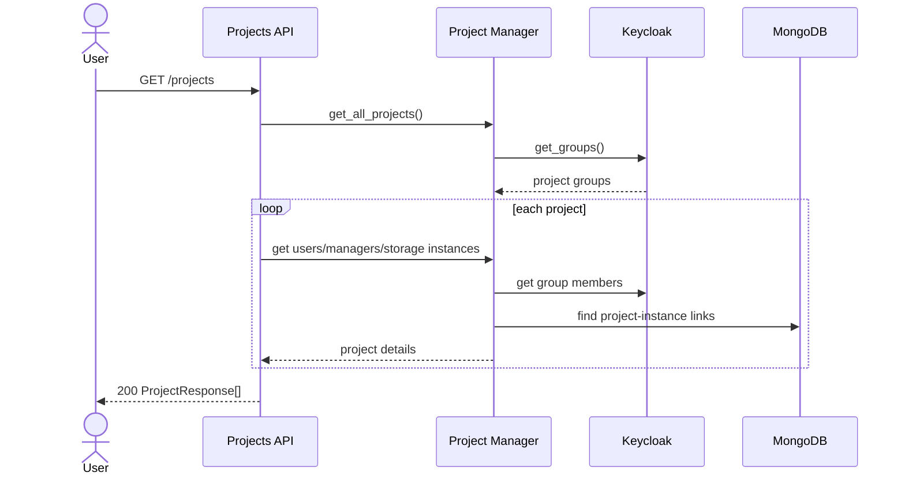
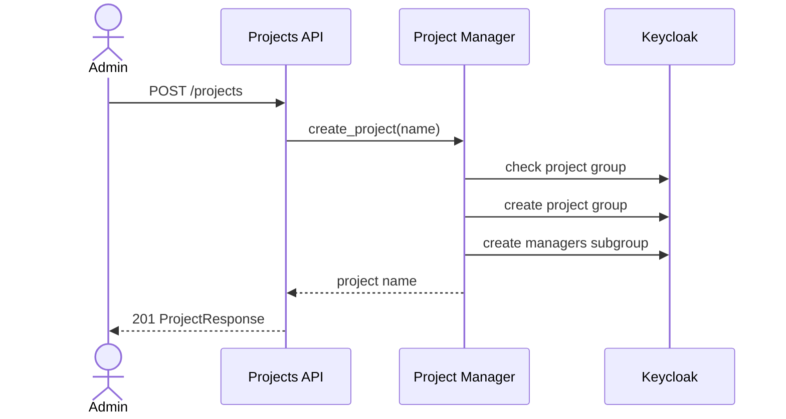
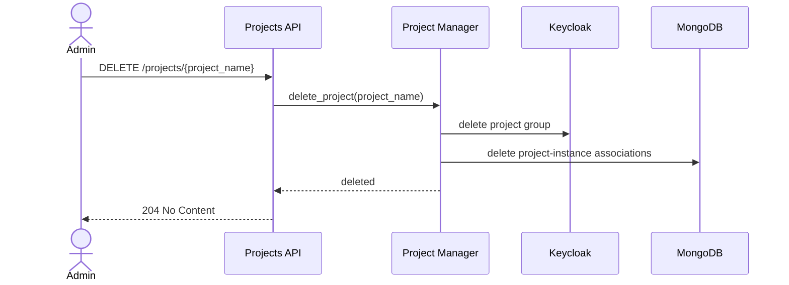

**Last Updated:** 2026-06-29

# Project Management CRUD Sequence Diagrams

## List Projects

```mermaid
sequenceDiagram
    actor User
    participant API as Projects API
    participant PM as Project Manager
    participant KC as Keycloak
    participant DB as MongoDB

    User->>API: GET /projects
    API->>PM: get_all_projects()
    PM->>KC: get_groups()
    KC-->>PM: project groups

    loop each project
        API->>PM: get users/managers/storage instances
        PM->>KC: get group members
        PM->>DB: find project-instance links
        PM-->>API: project details
    end

    API-->>User: 200 ProjectResponse[]
```

## Create Project

```mermaid
sequenceDiagram
    actor Admin
    participant API as Projects API
    participant PM as Project Manager
    participant KC as Keycloak

    Admin->>API: POST /projects
    API->>PM: create_project(name)
    PM->>KC: check project group
    PM->>KC: create project group
    PM->>KC: create managers subgroup
    PM-->>API: project name
    API-->>Admin: 201 ProjectResponse
```

## Delete Project

```mermaid
sequenceDiagram
    actor Admin
    participant API as Projects API
    participant PM as Project Manager
    participant KC as Keycloak
    participant DB as MongoDB

    Admin->>API: DELETE /projects/{project_name}
    API->>PM: delete_project(project_name)
    PM->>KC: delete project group
    PM->>DB: delete project-instance associations
    PM-->>API: deleted
    API-->>Admin: 204 No Content
```

